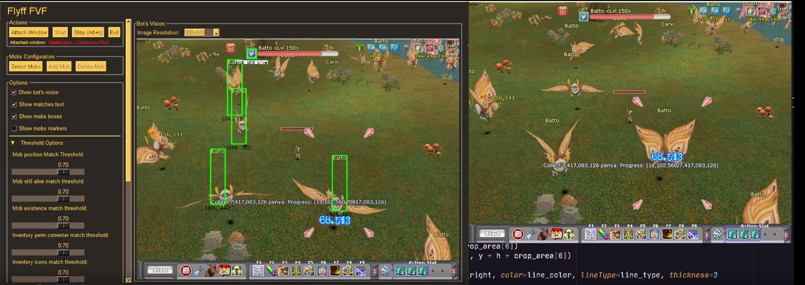

<br />
<p align="center">
  <h3 align="center">Flyff Bots</h3>

  <p align="center">
	Flyff is a MMORPG game that I used to play when I was a kid. I always wanted to create a bot for it and here I am.
	This project is a set of bots that I created for Flyff. It has bot for farming and for upgrading your items.
	<br />
	:warning: Windows only :warning:
    <br />
	<br />
    <a href="https://github.com/xandao-dev/flyff-bots"><strong>Explore the docs »</strong></a>
    <br />
    <a href="https://github.com/xandao-dev/flyff-bots/issue">Report Bug</a>
    ·
    <a href="https://github.com/xandao-dev/flyff-bots/issues">Request Feature</a>
  </p>
</p>


<details open="open">
  <summary>Table of Contents</summary>
  <ol>
    <li>
      <a href="#about-the-project">About The Project</a>
      <ul>
        <li><a href="#features">Features</a></li>
        <li><a href="#built-with">Built With</a></li>
      </ul>
    </li>
    <li>
      <a href="#getting-started">Getting Started</a>
      <ul>
        <li><a href="#installation">Installation</a></li>
      </ul>
    </li>
    <li><a href="#usage">Usage</a></li>
    <li><a href="#roadmap">Roadmap</a></li>
    <li><a href="#contributing">Contributing</a></li>
    <li><a href="#license">License</a></li>
    <li><a href="#contact">Contact</a></li>
  </ol>
</details>


## About The Project

<div align="center">
<b>Foreground Vision Bot</b>
<p>See the Foreground Vision Bot guide <a href="./foreground_vision_bot/docs/README.md">here</a></p>




<b>Awakening Bot</b>


https://user-images.githubusercontent.com/22106326/150702322-967cf2d8-d789-45e6-af61-503c96dc2ea9.mp4
</div>

### Features

**Foreground Vision Bot**

* :star: Works very good :star:
* Track the monsters by it's names using computer vision (OpenCV)
* Automatically attack the monsters and move to the next one
* If no monsters are found, it will automatically run to find more monsters
* Human-like mouse movement
* GUI available, to watch the bot and configure it

**Awakening Bot**

* :star: Works very good :star:
* Automatically awaken your items until you get the required stats
* Works on background or foreground
* Works using OCR

**Foreground Farm**

* :warning: Does not work very well :warning:
* Farm bot that works on foreground
* Works moving the mouse on the screen to see if it finds a monster
* Works matching pixel colors

**Recording Bot**

* :warning: Does not work very well :warning:
* It records your actions like moving, attacking, drinking potions and etc.
* Generates a file that you can use to replay your actions
* Works on background or foreground


### Built With

* [Python3](https://www.python.org/) - A general-purpose, high-level programming language
* [OpenCV](https://opencv.org/) - Open source computer vision library
* [pytesseract](https://pypi.org/project/pytesseract/) - Google's Tesseract OCR library
* [pyttsx3](https://pypi.org/project/pyttsx3/) - Speech synthesis library
* [numpy](https://www.numpy.org/) - Scientific computing package


## Getting Started

To get a local copy up and running follow these simple steps.

### Installation

1. Clone the repo
  ```sh
  git clone https://github.com/xandao-dev/flyff-bots.git
  ```

2. Install dependencies
  ```sh
  cd flyff-bots
  python3 -m pip install -r requirements.txt
  ```

### Common Issues

1. `import win32gui ImportError: DLL load failed: The specified module could not be found.`
    * Install [pywin32](https://github.com/mhammond/pywin32/releases) from binaries for your python version

## Usage

* Run foreground vision bot

  1. Follow the [configuration](./foreground_vision_bot/docs/README.md) steps to configure the bot
  2. Run the bot: `python3 foreground_vision_farm.py`

* Run awakening bot

  1. Open the game
  2. Run the bot: `python3 background_awake.py`

* Run foreground farm

  1. Open the game
  2. Run the bot: `python3 foreground_farm.py`

* Run recording bot

  1. Open the game
  2. Run the recorder: `python3 recorder.py` or `python3 recorder_no_mouse.py`
  3. Run the playback: `python3 foreground_playback.py` or `python3 background_playback.py`

## Roadmap

See the [open issues](https://github.com/xandao-dev/flyff-bots/issues) for a list of proposed features (and known issues).

## Contributing

Contributions are what make the open source community such an amazing place to be learn, inspire, and create. Any contributions you make are **greatly appreciated**.

1. Fork the Project
2. Create your Feature Branch (`git checkout -b feature/AmazingFeature`)
3. Commit your Changes (`git commit -m 'Add some AmazingFeature'`)
4. Push to the Branch (`git push origin feature/AmazingFeature`)
5. Open a Pull Request

## License

Distributed under the MIT License. See [LICENSE](./LICENSE.md) for more information.

Free software =)

## Contact

Alexandre Calil - [Linkedin](https://www.linkedin.com/in/xandao-dev/) - [alexandre@xandao.dev](mailto:alexandre@xandao.dev)

Project Link: [https://github.com/xandao-dev/flyff-bots](https://github.com/xandao-dev/flyff-bots)
