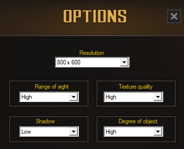
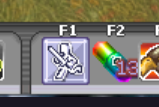
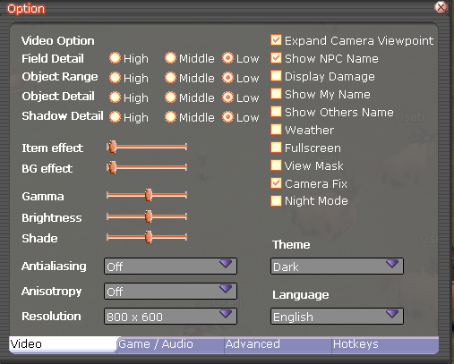
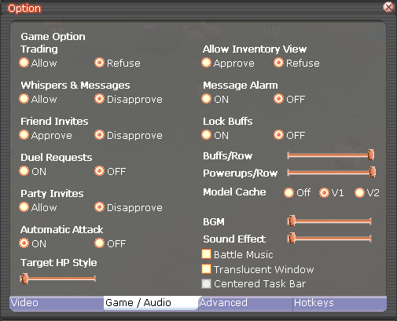
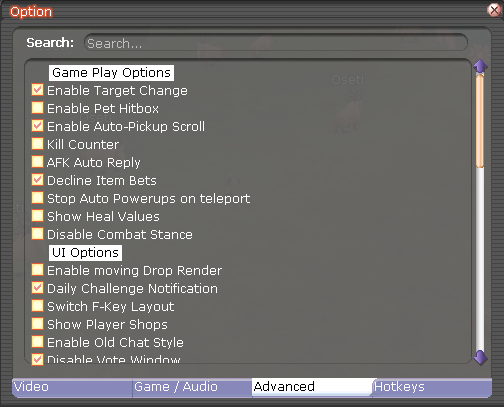
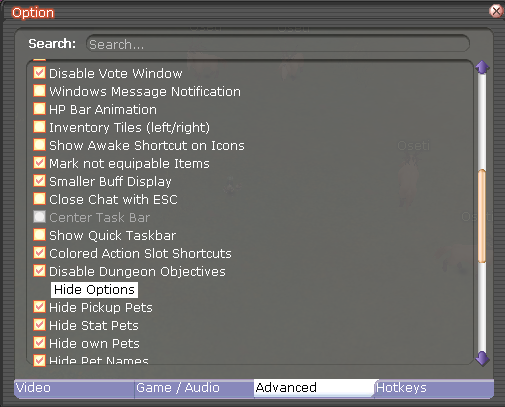
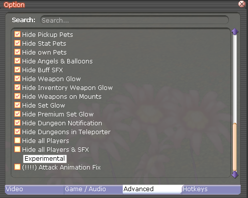
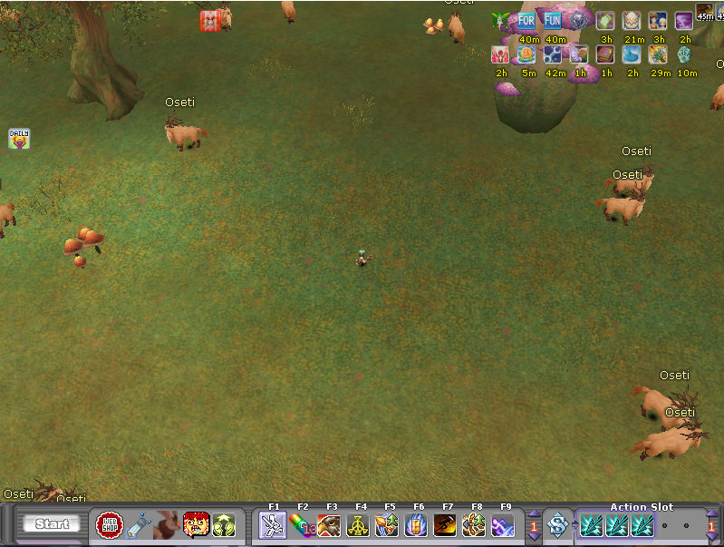

 

  <h3 align="center">Flyff Foreground Vision Farm</h3>

  

	:warning: Windows only :warning:
     

  
Table of Contents

  <ol>
    <li><a href="#instructions">Instructions</a></li>
    <li><a href="#usage">Usage</a></li>
    <li><a href="#add-new-monsters">Roadmap</a></li>
    <li><a href="#contact">Contact</a></li>
  </ol>

## Instructions

<b>Foreground Vision Bot - Instructions </b>

 

Put the attack button in F1 Hotkey

 

Set the settings, dark mode is important!

 

You will end with a camera like this

## Usage

  1. Make sure you have installed the [dependencies](../../README.md#installation)
  2. Follow the [instructions](#instructions) above
  2. Run the bot: `python3 foreground_vision_farm.py`

## Add New Monsters

  1. Navigate to "foreground_vision_bot/assets/names"
  2. Add an image with the name of the new monster. Take a look at the images inside this folder to see how it's done, it needs to be accurate.
  3. Go back to "foreground_vision_bot/assets" and you will see a file called Assets.py. Read the file and add your new monster there, following the other monsters already added.

  There is a task to easier this process, but it's not done yet. Feel free to contribute.

## Contact

Alexandre Calil - [Linkedin](https://www.linkedin.com/in/xandao-dev/) - [alexandre@xandao.dev](mailto:alexandre@xandao.dev)

Project Link: [https://github.com/xandao-dev/flyff-bots](https://github.com/xandao-dev/flyff-bots)
